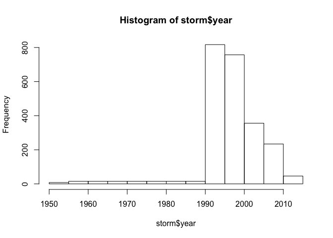

# Reproducible Research: Peer Assessment 2
Nikita Kirnosov  


## Synopsys

Storms and other severe weather events can cause both public health and economic problems for communities and municipalities. Many severe events can result in fatalities, injuries, and property damage, and preventing such outcomes to the extent possible is a key concern.

This project involves exploring the U.S. National Oceanic and Atmospheric Administration's (NOAA) storm database. This database tracks characteristics of major storms and weather events in the United States, including when and where they occur, as well as estimates of any fatalities, injuries, and property damage.


## Data

The data for this assignment come in the form of a comma-separated-value file compressed via the bzip2 algorithm to reduce its size. You can download the file from the course web site:

[Storm Data](https://d396qusza40orc.cloudfront.net/repdata%2Fdata%2FStormData.csv.bz2) [47Mb]
There is also some documentation of the database available. Here you will find how some of the variables are constructed/defined.

[National Weather Service Storm Data Documentation](https://d396qusza40orc.cloudfront.net/repdata%2Fpeer2_doc%2Fpd01016005curr.pdf)

[National Climatic Data Center Storm Events FAQ](https://d396qusza40orc.cloudfront.net/repdata%2Fpeer2_doc%2FNCDC%20Storm%20Events-FAQ%20Page.pdf)

The events in the database start in the year 1950 and end in November 2011. In the earlier years of the database there are generally fewer events recorded, most likely due to a lack of good records. More recent years should be considered more complete.

## Data Processing

### Loading Data

Let's start by cleaning up the environment and loading libraries


```r
rm(list=ls())
library("dplyr")
```

Depending on what is already in the directory, download, unzip and/or read the file.


```r
fileURL <- "https://d396qusza40orc.cloudfront.net/repdata%2Fdata%2FStormData.csv.bz2"
fileCSV <- "storm.csv.bz2"
if(!file.exists(fileCSV)){
        download.file(fileURL,destfile=fileCSV,method="curl")
}
dt <- read.csv(bzfile(fileCSV), stringsAsFactors = FALSE)
```

### Preprocessing 

For the purpose of this analysis, we are interested in year when the event started,
its type, how many injuries and fatalities did it cause, and how much economical damage 
was done. Year will be extracted from the `BGN_DATE` column, event type is given by `EVTYPE`
field, fatalities and injuries - by `FATALITIES` and `INJURIES`, total numbers for
property damage should be calculated as `PROPDMG` $\times$ 10$^{PROPDMGEXP}$,
crop damage - as `CROPDMG` $\times$ 10$^{CROPDMGEXP}$.
Since powers of 10 are not always given as numbers, we should translate characters
into numbers according to the following table:


Character   Number 
----------  -------
H / h       2      
K / k       3      
M / m       6      
B / b       9      
Other       NA     

This conversion can be done by the following function:


```r
to_exp <- function(p){
        as.numeric(ifelse(tolower(p)=="k",3,
                          ifelse(tolower(p)=="m",6,
                                 ifelse(tolower(p)=="b",9,
                                        ifelse(tolower(p)=="h",2,
                                               ifelse(tolower(p)=="",0,p))))))
        }
```

With that said, let us create a new data set where only the columns of interest 
are preserved.


```r
storm <- mutate(dt, 
                year = as.numeric(format(as.Date(BGN_DATE, 
                                                     format = "%m/%d/%Y %H:%M:%S"), "%Y")),
                event = EVTYPE,
                fatalities = FATALITIES,
                injuries = INJURIES,
                property_damage = PROPDMG * 10^to_exp(PROPDMGEXP),
                crop_damage = CROPDMG * 10^to_exp(CROPDMGEXP)
                ) %>% 
        select(-(1:dim(dt)[2]))
```

Since we are going to concider total values, it is handy to tidy this data set
to contain the features totals per year per event.


```r
storm <- aggregate(. ~year + event, storm, sum)
```

### Initial analysis (year cutoff)

From the histogram and table below we can clearly see that before 1993 
much fewer event types were recorded.


```r
hist(storm$year,breaks=length(unique(storm$year)),
     main="Number of event types registered",
     ylab="Number of event types",xlab="year")
```

 

```r
count(storm[(storm$year %in% (1990:1996)),],year)
```

```
## Source: local data frame [7 x 2]
## 
##   year   n
## 1 1990   3
## 2 1991   3
## 3 1992   3
## 4 1993 160
## 5 1994 267
## 6 1995 384
## 7 1996 228
```

The information is only available for these events:


```r
unique((storm[(storm$year < 1993),])$event)
```

```
## [1] "HAIL"      "TORNADO"   "TSTM WIND"
```

In order to make comparison of these events to those whose records start
after 1993 possible, we will only use data collected in and after 1993.


```r
storm <- storm[storm$year >= 1993,]
```

## Results

To start with, let us define a function which is producing a bar plot
of a requested `feature` versus a specified number of most damaging
`event` types; logscale (`logsc`) is also allowed.


```r
agg_order_top_plot <- function(data, feature, top=10, desc,logsc=""){
        arguments <- as.list(match.call())
        feature = eval(arguments$feature, data)
        
        temp <- aggregate(feature ~ event, data = data, FUN = sum)
        temp <- temp[order(temp$feature, decreasing = TRUE), ]
        temp <- temp[(1:top),]
        
        barplot(temp$feature,
      ylab = paste("Total",desc),
      names.arg = temp$event,
      log=logsc,
      cex.names = 0.75,
      cex.axis = 0.75,
      main = paste("Total",desc, "\nby Event Type")
      )
}
```

### Which event types are most harmful to population health?

In order to investigate the impact of different event types on population
health, let us consider three bar plots showing total numbers of fatalities,
injuries, and their sum for the period 1993-2011.


```r
par( mfrow = c(1,3), mar = c(9, 5, 3, 1),las = 2)
agg_order_top_plot(data=storm,feature=fatalities,desc="Fatalities")
agg_order_top_plot(data=storm,feature=injuries,desc="Injuries")
agg_order_top_plot(data=storm,feature=fatalities+injuries,desc="Cauzalities")
```

 

It can be seen that tornadoes and excessive heat have by far the greatest impact
in these categories.

### Which event types have the greatest economic consequences?

Below the three graphs for property damage, crop damage, and their sum 
in US dollars for the period 1993-2011 are shown.


```r
par( mfrow = c(1,3), mar = c(9, 5, 3, 3),las = 2)
agg_order_top_plot(data=storm,feature=property_damage,
              desc="Property Damage, USD",logsc="y")
agg_order_top_plot(data=storm,feature=crop_damage,
              desc="Crop Damage, USD",logsc="y")
agg_order_top_plot(data=storm,feature=property_damage+crop_damage,
              desc="Economical Damage, USD",logsc="y")
```

 

It can be seen that floods cause most damage, while hurricanes and droughts
are also dangerous for property and crop.
