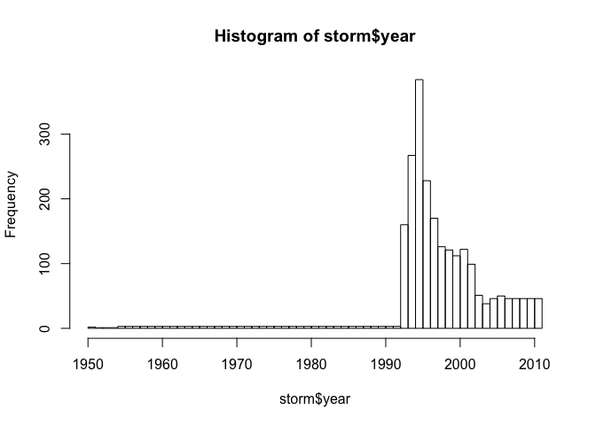

# Reproducible Research: Peer Assessment 2
Nikita Kirnosov  


## Introduction

Storms and other severe weather events can cause both public health and economic problems for communities and municipalities. Many severe events can result in fatalities, injuries, and property damage, and preventing such outcomes to the extent possible is a key concern.

This project involves exploring the U.S. National Oceanic and Atmospheric Administration's (NOAA) storm database. This database tracks characteristics of major storms and weather events in the United States, including when and where they occur, as well as estimates of any fatalities, injuries, and property damage.

## Data

The data for this assignment come in the form of a comma-separated-value file compressed via the bzip2 algorithm to reduce its size. You can download the file from the course web site:

[Storm Data](https://d396qusza40orc.cloudfront.net/repdata%2Fdata%2FStormData.csv.bz2) [47Mb]
There is also some documentation of the database available. Here you will find how some of the variables are constructed/defined.

[National Weather Service Storm Data Documentation](https://d396qusza40orc.cloudfront.net/repdata%2Fpeer2_doc%2Fpd01016005curr.pdf)

[National Climatic Data Center Storm Events FAQ](https://d396qusza40orc.cloudfront.net/repdata%2Fpeer2_doc%2FNCDC%20Storm%20Events-FAQ%20Page.pdf)

The events in the database start in the year 1950 and end in November 2011. In the earlier years of the database there are generally fewer events recorded, most likely due to a lack of good records. More recent years should be considered more complete.

## Loading and preprocessing the data

Let's start by cleaning up the environment and loading libraries


```r
rm(list=ls())
library("dplyr")
library("ggplot2")
```

Depending on what is already in the directory, download, unzip and/or read the file.


```r
fileURL <- "https://d396qusza40orc.cloudfront.net/repdata%2Fdata%2FStormData.csv.bz2"
fileCSV <- "storm.csv.bz2"
if(!file.exists(fileCSV)){
        download.file(fileURL,destfile=fileCSV,method="curl")
}
dt <- read.csv(bzfile(fileCSV), stringsAsFactors = FALSE)
```

Define useful function:


```r
to_exp <- function(p){
        as.numeric(ifelse(tolower(p)=="k",3,
               ifelse(tolower(p)=="m",6,
                      ifelse(tolower(p)=="b",9,
                             ifelse(tolower(p)=="h",2,
                                    ifelse(tolower(p)=="",0,p))))))
}
```

Tidy the data set:


```r
storm <- mutate(dt, 
                year = as.numeric(format(as.Date(BGN_DATE, 
                                                     format = "%m/%d/%Y %H:%M:%S"), "%Y")),
                event = EVTYPE,
                fatalities = FATALITIES,
                injuries = INJURIES,
                property_damage = PROPDMG * 10^to_exp(PROPDMGEXP),
                crop_damage = CROPDMG * 10^to_exp(CROPDMGEXP)
                ) %>% 
        select(-(1:dim(dt)[2]))
```

```
## Warning in to_exp(c("K", "K", "K", "K", "K", "K", "K", "K", "K", "K",
## "M", : NAs introduced by coercion
```

```
## Warning in to_exp(c("", "", "", "", "", "", "", "", "", "", "", "", "", :
## NAs introduced by coercion
```

```r
storm <- aggregate(. ~year + event, storm, sum)
```

Initial analysis (year cutoff)


```r
hist(storm$year,breaks=length(unique(storm$year)))
```

 

```r
count(storm[(storm$year %in% (1990:1996)),],year)
```

```
## Source: local data frame [7 x 2]
## 
##   year   n
## 1 1990   3
## 2 1991   3
## 3 1992   3
## 4 1993 160
## 5 1994 267
## 6 1995 384
## 7 1996 228
```


